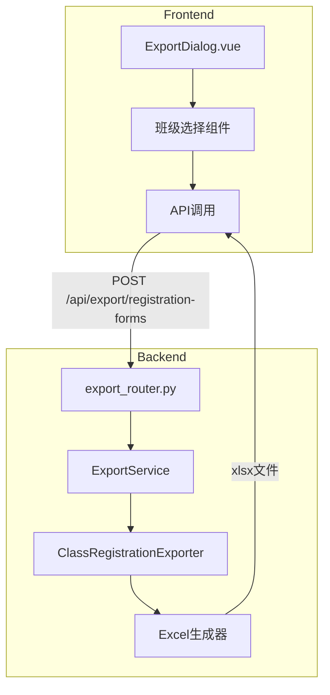

# Design Document: 报名表导出功能

## Overview

本设计实现运动会报名表的批量导出功能。系统允许管理员在项目配置完成后，通过弹窗多选班级，一键下载包含所选班级报名数据的Excel文件。报名数据按项目组别分组组织，便于现场核对和存档。

## Architecture



## Components and Interfaces

### 后端组件

#### 1. ExportService 扩展

在现有 `export_service.py` 中添加新方法：

```python
class ExportService:
    def get_exportable_classes(self) -> List[Dict]:
        """获取有报名记录的班级列表"""
        pass
    
    def export_class_registration_forms(
        self, 
        class_ids: List[int]
    ) -> bytes:
        """批量导出班级报名表"""
        pass
    
    def _build_class_sheet(
        self, 
        ws: Worksheet, 
        class_id: int
    ) -> None:
        """构建单个班级的工作表"""
        pass
    
    def _group_registrations_by_event_group(
        self, 
        registrations: List[Registration]
    ) -> Dict[str, List[Registration]]:
        """按项目组别分组报名记录"""
        pass
```

#### 2. API 路由

```python
# GET /api/export/exportable-classes
# 返回可导出的班级列表

# POST /api/export/registration-forms
# 请求体: {"class_ids": [1, 2, 3]}
# 返回: Excel文件流
```

### 前端组件

#### 1. RegistrationExportDialog.vue

班级选择弹窗组件，功能包括：
- 按年级分组显示班级
- 复选框多选
- 全选/反选/按年级选择
- 确认导出按钮

```vue
<template>
  <el-dialog title="报名表导出" v-model="visible">
    <div v-for="grade in gradeList" :key="grade.id">
      <el-checkbox 
        :indeterminate="isIndeterminate(grade)"
        v-model="gradeCheckAll[grade.id]"
        @change="handleGradeCheckAll(grade)"
      >
        {{ grade.name }}
      </el-checkbox>
      <el-checkbox-group v-model="selectedClasses">
        <el-checkbox 
          v-for="cls in grade.classes" 
          :key="cls.id" 
          :label="cls.id"
        >
          {{ cls.name }} ({{ cls.registration_count }}人)
        </el-checkbox>
      </el-checkbox-group>
    </div>
    <template #footer>
      <el-button @click="visible = false">取消</el-button>
      <el-button type="primary" @click="handleExport" :loading="loading">
        导出
      </el-button>
    </template>
  </el-dialog>
</template>
```

## Data Models

### API 请求/响应模型

```python
# 可导出班级信息
class ExportableClassInfo(BaseModel):
    id: int
    name: str
    grade_id: int
    grade_name: str
    registration_count: int

# 导出请求
class ClassRegistrationExportRequest(BaseModel):
    class_ids: List[int] = Field(..., min_length=1)

# 按年级分组的班级列表响应
class ExportableClassesResponse(BaseModel):
    grades: List[Dict]  # [{id, name, classes: [ExportableClassInfo]}]
```

### Excel 数据结构

每个班级工作表结构：

```
┌─────────────────────────────────────────────────────────────┐
│                    一年级1班 报名表                           │
├─────────────────────────────────────────────────────────────┤
│ 【男子100米 - 男子甲组】                                      │
├──────┬────────┬──────┬──────┬──────────┬─────────┤
│ 序号 │ 学号   │ 姓名 │ 性别 │ 项目名称 │ 组别    │
├──────┼────────┼──────┼──────┼──────────┼─────────┤
│ 1    │ 001    │ 张三 │ 男   │ 100米    │ 男子甲组│
│ 2    │ 002    │ 李四 │ 男   │ 100米    │ 男子甲组│
├─────────────────────────────────────────────────────────────┤
│ 【女子100米 - 女子甲组】                                      │
├──────┬────────┬──────┬──────┬──────────┬─────────┤
│ 序号 │ 学号   │ 姓名 │ 性别 │ 项目名称 │ 组别    │
├──────┼────────┼──────┼──────┼──────────┼─────────┤
│ 1    │ 003    │ 王芳 │ 女   │ 100米    │ 女子甲组│
└─────────────────────────────────────────────────────────────┘
```


## Correctness Properties

*A property is a characteristic or behavior that should hold true across all valid executions of a system-essentially, a formal statement about what the system should do. Properties serve as the bridge between human-readable specifications and machine-verifiable correctness guarantees.*

### Property 1: 班级列表过滤正确性

*For any* 数据库中的班级集合，调用 `get_exportable_classes()` 返回的班级列表应该：
- 只包含至少有一条报名记录的班级
- 每个班级信息包含 id、name、grade_name、registration_count 字段
- registration_count 等于该班级实际的报名记录数

**Validates: Requirements 1.1, 1.2, 1.3**

### Property 2: 工作表结构正确性

*For any* 非空的班级ID列表，调用 `export_class_registration_forms(class_ids)` 生成的Excel文件应该：
- 工作表数量等于 class_ids 的长度
- 每个工作表名称格式为 "{年级名}-{班级名}"
- 每个工作表包含对应班级的所有报名记录

**Validates: Requirements 2.1, 2.2, 2.3**

### Property 3: 组别分组正确性

*For any* 班级的报名记录集合，生成的工作表内容应该：
- 按 (项目名称, 组别名称) 分组显示
- 每个组别区域包含组别标题行
- 只显示有报名记录的组别
- 无组别的报名记录归入"默认组"

**Validates: Requirements 3.1, 3.2, 3.3, 3.4**

### Property 4: 报名表内容格式正确性

*For any* 报名记录，在生成的Excel中应该：
- 包含字段：序号、学号、姓名、性别、项目名称、组别名称
- 性别字段："M" 显示为 "男"，"F" 显示为 "女"
- 记录排序：先按项目名称，再按组别名称，最后按学号

**Validates: Requirements 4.1, 4.2, 4.3, 4.4**

### Property 5: Excel文件格式有效性

*For any* 导出操作，生成的文件应该：
- 是有效的 xlsx 格式文件
- 可以被 openpyxl 正确解析

**Validates: Requirements 5.1**

## Error Handling

| 错误场景 | 处理方式 | HTTP状态码 |
|---------|---------|-----------|
| class_ids 为空列表 | 返回错误提示 "请至少选择一个班级" | 400 |
| class_ids 包含不存在的班级ID | 忽略无效ID，只处理有效班级 | 200 |
| 所有 class_ids 都无效 | 返回错误提示 "未找到有效班级" | 404 |
| 数据库查询失败 | 返回服务器错误 | 500 |

## Testing Strategy

### 测试框架

- 后端单元测试：pytest
- 属性测试：hypothesis
- 前端测试：vitest (可选)

### 单元测试

1. **get_exportable_classes 测试**
   - 测试空数据库返回空列表
   - 测试有报名记录的班级被正确返回
   - 测试无报名记录的班级被过滤

2. **export_class_registration_forms 测试**
   - 测试单个班级导出
   - 测试多个班级导出
   - 测试空班级ID列表错误处理

3. **_group_registrations_by_event_group 测试**
   - 测试正常分组
   - 测试无组别情况
   - 测试空报名列表

### 属性测试

使用 hypothesis 库进行属性测试，每个属性测试运行至少 100 次迭代。

```python
from hypothesis import given, strategies as st

# Property 1: 班级列表过滤
@given(st.lists(st.builds(Class, ...)))
def test_exportable_classes_filter(classes):
    """Feature: registration-export, Property 1: 班级列表过滤正确性"""
    pass

# Property 2: 工作表结构
@given(st.lists(st.integers(min_value=1), min_size=1))
def test_worksheet_structure(class_ids):
    """Feature: registration-export, Property 2: 工作表结构正确性"""
    pass

# Property 3: 组别分组
@given(st.lists(st.builds(Registration, ...)))
def test_group_by_event_group(registrations):
    """Feature: registration-export, Property 3: 组别分组正确性"""
    pass

# Property 4: 内容格式
@given(st.builds(Registration, ...))
def test_content_format(registration):
    """Feature: registration-export, Property 4: 报名表内容格式正确性"""
    pass

# Property 5: Excel格式
@given(st.lists(st.integers(min_value=1), min_size=1))
def test_excel_format_valid(class_ids):
    """Feature: registration-export, Property 5: Excel文件格式有效性"""
    pass
```

### 测试数据生成策略

```python
# 生成有效的班级数据
class_strategy = st.builds(
    Class,
    id=st.integers(min_value=1),
    name=st.text(min_size=1, max_size=20),
    grade_id=st.integers(min_value=1)
)

# 生成有效的报名数据
registration_strategy = st.builds(
    Registration,
    student_id=st.integers(min_value=1),
    event_id=st.integers(min_value=1),
    group_id=st.one_of(st.none(), st.integers(min_value=1))
)
```
